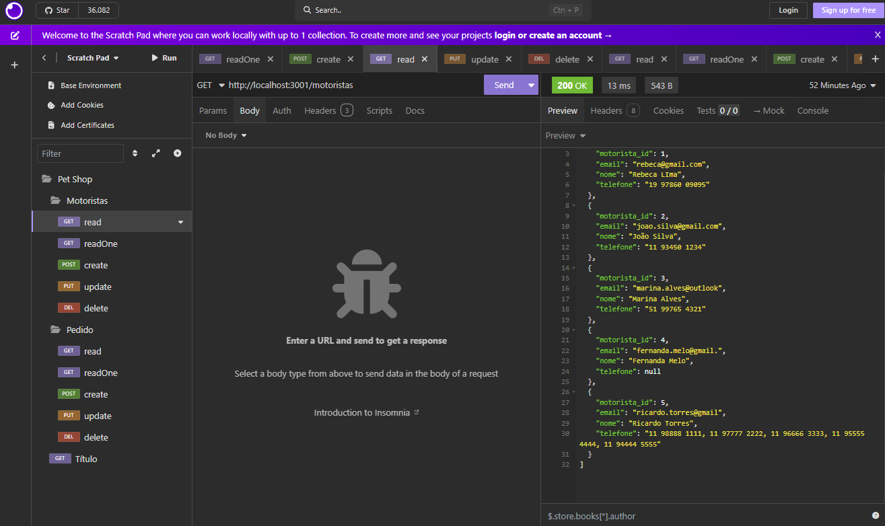
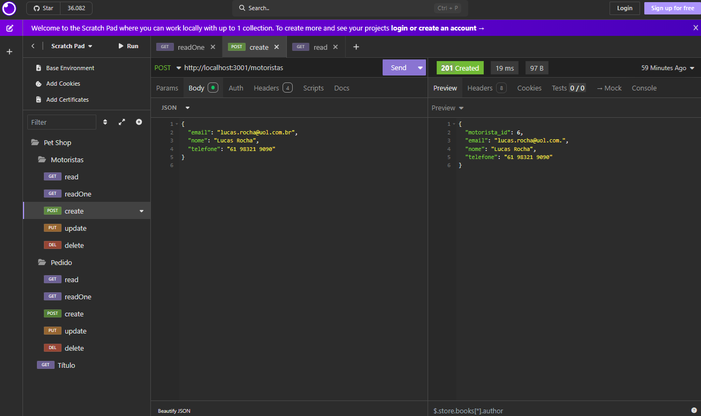
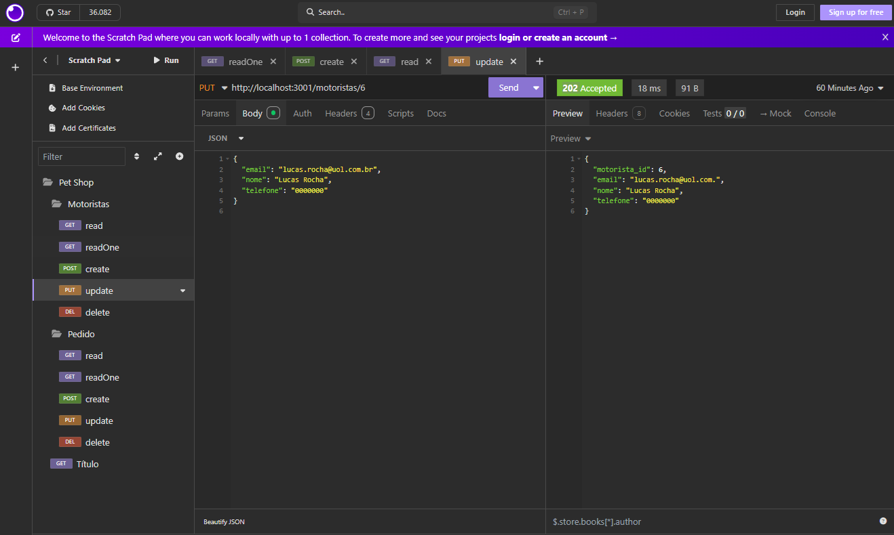
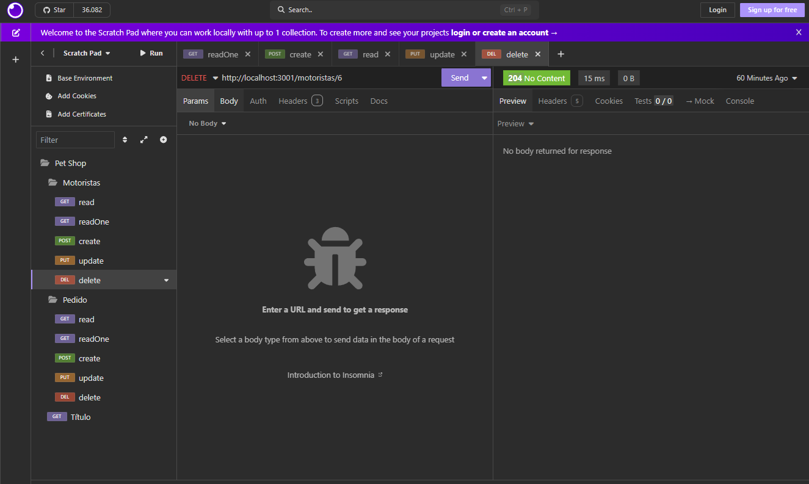
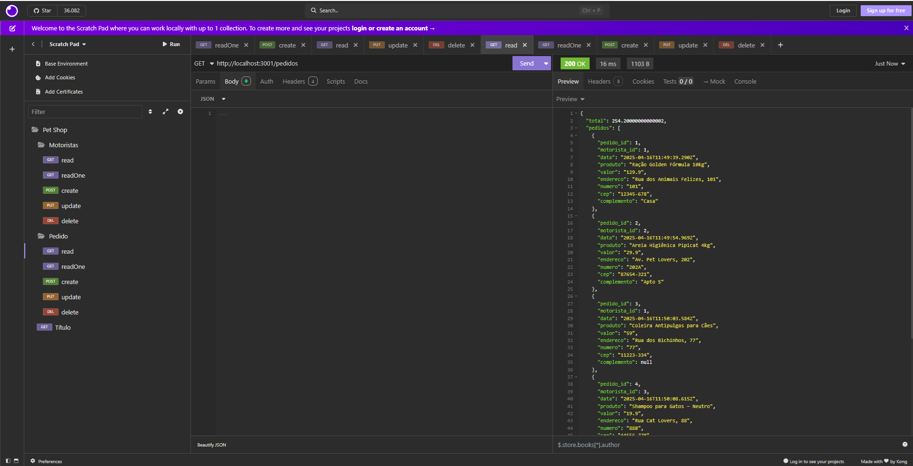
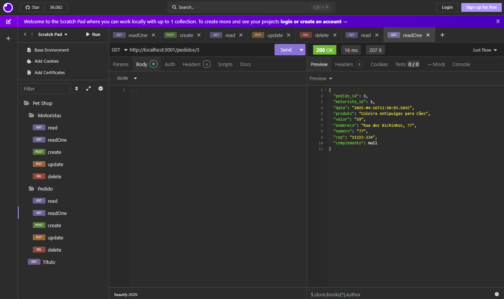
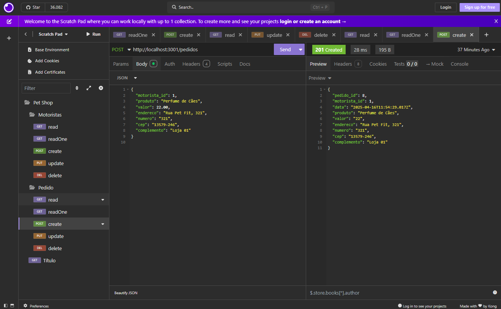
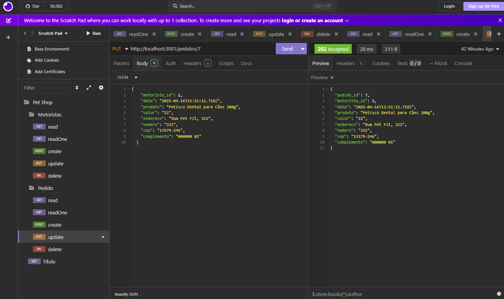
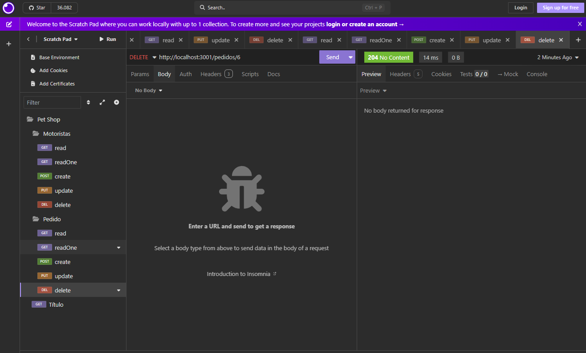

# SNOOPY PetShop Delivery API
Situação de Aprendizagem - Back-End (Node.JS, JavaSript, VsCode, ORM Prisma, Insomnia)
## Contextualização
SNOOPY PetShop tem atuado em nossa cidade com ótimo atendimento e agilidade, é nosso cliente e necessita de um sistema Web para registro das entregas ou serviços a domicílio, como busca de animais para banho, tosa e outros serviços.<br>O P.O. após uma visita ao cliente elaborou o DER e UML DC(Diagrama de Classes) a seguir e elencou os requisitos funcionais.<br>

## Desafio
Desenvolver as funcionalidades conforme requisitos

### Requisitos funcionais
- [RF001] O sistema deve permitir o CRUD de Motoristas.
    - [RF001.1] Um motorista pode possuir mais de um telefone ou nenhum, desta forma o campo telefones deve ter espaço suficiente para cadastrar vários números (255 caracteres) e permitir nulo.
    - [RF001.2] A rota **readOne** do motorista deve mostrar os dados de um cliente específico e seus pedidos.
- [RF002] O sistema deve permitir o CRUD de pedidos.
    - [RF002.1] O sistema deve associar o pedido a um motorista.
    - [RF002.1] O Pedido deve na rota **read** deve somar o total dos **valores**.

### Casos de teste (Insomnia)
- [CT001] Deve ser cadastrado pelo menos 5 motoristas.
- [CT002] Deve ser cadastrado 1 telefone para cada motorista.
    - [CT002.1] Pelo menos 1 motorista não deve ter telefone cadastrado, ou seja **nulo**.
- [CT003] Cadastre, altere e exclua um motorista.
- [CT004] Cadastre um pedido para cada motorista.
    - [CT004.1] Pelo menos um motorista deve ter dois ou mais pedidos cadastrados.
- [CT005] Cadastre, altere e exclua um pedido.

## Tecnologias
- Node.js (Framework)
- VsCode (IDE)
- Insomnia (IDE de testes)
- Prisma (ORM)
- XAMPP (IDE) SGBD MySQL

## Passo a Passo de como executar a API
- 1 Clone este repositório
- 2 Abrir com Vscode
- 3 Criar o arquivo **.env** na pasta API contendo:
```js
DATABASE_URL="mysql://root@localhost:3306/petshodelivery?schema=public&timezone=UTC"
PORT=3001
```
- Obs: certifique-se de não ter um banco de dados chamado **petshopdelivery** no seu MySQL.
- 4 Abrir o XAMPP e dar start em MySQL
- 5 No VsCode abra um terminal **CTRL + '** cmd ou bash e digite os seguintes comandos para baixar as dependências e instalar o Banco de dados
```bash
cd api
npm install
npm i prisma -g
npx prisma migrate dev --name init
npx nodemon
# ou
npm start
```
- 6 Caso seja necessário remover o banco de dados para testar a criação novamente
    - Exclua a pasta migrations
```bash
prisma migrate reset
```

- 7 Abra o Insomnia e importe o arquivo **./docs/insomnia.yaml** para realizar os testes.

## Prints dos testes
- Motorista (read)


- Motoristas (readOne)


- Motorista (create)


- Motorista (update)


- Motorista (delete)


- Pedido (read)


- Pedido (readOne)


- Pedido (create)


- Pedido (update)


- Pedido (update)
